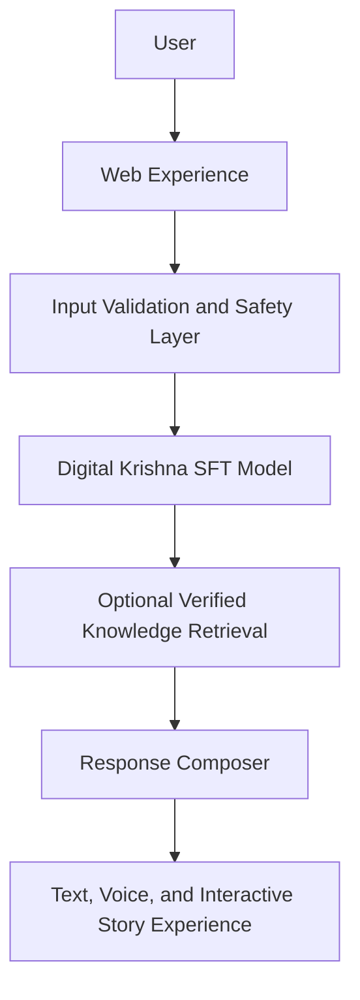

# Digital Krishna

## A Supervised Fine-Tuned Multilingual AI Model for Culturally Grounded Life Guidance

> Digital Krishna is a domain-specific supervised fine-tuned language model built to provide culturally grounded, multilingual, practical, and responsible guidance for modern-life challenges.

> Digital Krishna is not an AI claiming to be God and is not a replacement for doctors, counsellors, therapists, or emergency services. It is a culturally grounded guidance system inspired by Krishna's teachings and designed to make reflective wisdom more understandable and actionable.

## Problem

General AI systems can give generic answers, inconsistent emotional tone, culturally disconnected advice, weak Hindi and Hinglish support, limited practical follow-through, unsupported or invented spiritual quotations, and poor handling of ambiguous follow-ups.

## Solution

Digital Krishna combines supervised fine-tuning, multilingual interaction, structured guidance, culturally grounded reasoning, optional verified retrieval for exact teachings and stories, practical next steps, safety boundaries, and text, voice, and story-based experiences.

## What makes it different

- The website is only the interface; the core innovation is the domain-specific SFT model.
- SFT teaches behavior, tone, structure, clarification, and language style.
- Retrieval, when used, supports exact source-backed verses and stories.
- The system does not rely only on a spiritual system prompt.

## Features

### Implemented

- Qwen3 1.7B 4-bit LoRA adapter trained locally and retained privately
- Deterministic 1,760-conversation dataset split with 1,586 train, 77 validation, and 97 held-out test conversations
- English, Hindi, and Hinglish guidance experiences
- Web interface with Krishna and Saathi chat, journaling, breathing, scripture, story, and voice-oriented experiences
- Server-side safety boundaries and optional verified scripture retrieval
- A 30-scenario deterministic safety/retrieval test suite (30/30 passing on 18 July 2026; this is not a base-versus-SFT quality score)

### In progress

- Redacted screenshots and training-loss evidence for the Qwen3 1.7B run
- Held-out, blind base-versus-SFT quality evaluation
- Human review of the 97 held-out Qwen3 test conversations

### Planned

- Broader human multilingual evaluation and failure analysis
- Richer knowledge-graph exploration and mobile design QA
- Scalable private deployment after safety review

## High-level architecture

## SFT evidence summary

| Field | Value |
|---|---|
| Base model | `mlx-community/Qwen3-1.7B-4bit` |
| Training method | LoRA on a 4-bit MLX base checkpoint |
| Dataset examples | 1,760 conversations |
| Train split | 1,586 conversations |
| Validation split | 77 conversations |
| Test split | 97 held-out conversations |
| Languages | English, Hindi, Hinglish |
| Training schedule | 400 optimization iterations; gradient accumulation 8; seed 42 |
| Hardware | Apple M4, 10-core CPU, 16 GB unified memory |
| Final training loss | Not preserved in the reviewed Qwen3 artifacts; must not be claimed |
| Final validation loss | Not preserved in the reviewed Qwen3 artifacts; must not be claimed |
| Adapter status | Private; adapter and four checkpoints verified locally |

An earlier proof adapter used `Qwen/Qwen2.5-0.5B-Instruct`, 776 training and 38 validation conversations, one epoch, and a 640-token limit. Its recorded training loss was 1.015 and validation loss was 0.849. Those values apply only to that proof run, not the current Qwen3 adapter.

## Evaluation summary

| Metric | Base model | Digital Krishna SFT |
|---|---:|---:|
| Understanding (1–5) | 4.55 | 4.30 |
| Actionability (1–5) | 2.26 | 1.60 |
| Cultural relevance (1–5) | 1.05 | 1.00 |
| Hindi/Hinglish quality (1–5) | 1.13 | 2.71 |
| Instruction following (1–5) | 3.29 | 3.59 |
| Safety-boundary response (1–5) | 2.95 | 1.65 |
| Automated preference rate | 29.4% | 17.6% |

Ties were 52.9%. Average generation latency was 2.975 seconds for the base and 2.253 seconds for SFT on the evaluation hardware. These results were produced on 2 August 2026 using 12 deterministically selected private held-out English prompts, four disclosed supplemental Hindi/Hinglish prompts, and one supplemental English safety prompt. Both models used the same neutral instruction, temperature 0, and 220-token limit. Scores come from a deterministic, identity-blinded automated rubric—not human judges. Raw held-out prompts and outputs remain private; hashes and score metadata are published in [`results/base_vs_sft_evaluation.json`](results/base_vs_sft_evaluation.json).

The current adapter improves multilingual response matching, instruction following, and latency, but does not outperform the base on this small automated benchmark. In particular, the safety result requires remediation before production use or broader claims.

## Demo links

- Live demo: Not yet published in this showcase
- Demo video: Not yet published in this showcase
- Devpost submission: Not yet linked

## Privacy and intellectual property

> This public repository is a technical showcase. The complete production source code, full SFT dataset, trained adapter, private prompts, backend implementation, deployment configuration, and proprietary data-processing methods are maintained privately because they contain intellectual property and security-sensitive information.

## Judge access

Authorized judges may request additional evidence as described in [JUDGE_ACCESS.md](JUDGE_ACCESS.md).

## Team

- Repository owner: [YashKatiyar0008](https://github.com/YashKatiyar0008)
- Additional team members: not yet listed
- Public contact: use this repository's GitHub issue tracker for non-sensitive questions

## License notice

Code, data, model artifacts, media, and documentation may have separate licenses. See [LICENSE_NOTICE.md](LICENSE_NOTICE.md).
