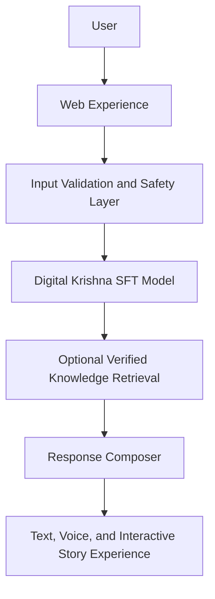

# Digital Krishna

## A Supervised Fine-Tuned Multilingual AI Model for Culturally Grounded Life Guidance

> Digital Krishna is a domain-specific supervised fine-tuned language model built to provide culturally grounded, multilingual, practical, and responsible guidance for modern-life challenges.

> Digital Krishna is not an AI claiming to be God and is not a replacement for doctors, counsellors, therapists, or emergency services. It is a culturally grounded guidance system inspired by Krishna's teachings and designed to make reflective wisdom more understandable and actionable.

## Problem

General AI systems can give generic answers, inconsistent emotional tone, culturally disconnected advice, weak Hindi and Hinglish support, limited practical follow-through, unsupported or invented spiritual quotations, and poor handling of ambiguous follow-ups.

## Solution

Digital Krishna combines supervised fine-tuning, multilingual interaction, structured guidance, culturally grounded reasoning, optional verified retrieval for exact teachings and stories, practical next steps, safety boundaries, and text, voice, and story-based experiences.

## What makes it different

- The website is only the interface; the core innovation is the domain-specific SFT model.
- SFT teaches behavior, tone, structure, clarification, and language style.
- Retrieval, when used, supports exact source-backed verses and stories.
- The system does not rely only on a spiritual system prompt.

## Features

### Implemented

- [REPLACE_WITH_VERIFIED_IMPLEMENTED_FEATURES]

### In progress

- SFT evidence package: [STATUS]
- Held-out base-versus-SFT evaluation: [STATUS]

### Planned

- [REPLACE_WITH_VERIFIED_ROADMAP_ITEMS]

## High-level architecture

## SFT evidence summary

| Field | Value |
|---|---|
| Base model | [REPLACE_WITH_EXACT_MODEL_ID] |
| Training method | [LoRA / QLoRA / other verified method] |
| Dataset examples | [REPLACE_WITH_REAL_VALUE] |
| Train split | [REPLACE_WITH_REAL_VALUE] |
| Validation split | [REPLACE_WITH_REAL_VALUE] |
| Test split | [REPLACE_WITH_REAL_VALUE] |
| Languages | English, Hindi, Hinglish |
| Epochs | [REPLACE_WITH_REAL_VALUE] |
| Hardware | [REPLACE_WITH_REAL_VALUE] |
| Final training loss | [REPLACE_WITH_REAL_VALUE] |
| Final validation loss | [REPLACE_WITH_REAL_VALUE] |
| Adapter status | [Private / available to judges / not yet completed] |

## Evaluation summary

| Metric | Base model | Digital Krishna SFT |
|---|---:|---:|
| Understanding | [REAL] | [REAL] |
| Actionability | [REAL] | [REAL] |
| Cultural relevance | [REAL] | [REAL] |
| Hindi/Hinglish quality | [REAL] | [REAL] |
| Instruction following | [REAL] | [REAL] |
| Safety | [REAL] | [REAL] |
| Blind preference rate | [REAL] | [REAL] |

> No score should be published until it is produced from a held-out evaluation and verified by the team.

## Demo links

- Live demo: [ADD_LINK]
- Demo video: [ADD_LINK]
- Devpost submission: [ADD_LINK]

## Privacy and intellectual property

> This public repository is a technical showcase. The complete production source code, full SFT dataset, trained adapter, private prompts, backend implementation, deployment configuration, and proprietary data-processing methods are maintained privately because they contain intellectual property and security-sensitive information.

## Judge access

Authorized judges may request additional evidence as described in [JUDGE_ACCESS.md](JUDGE_ACCESS.md).

## Team

- Team name: [ADD_TEAM_NAME]
- Members: [ADD_VERIFIED_TEAM_MEMBERS]
- Contact: [ADD_PUBLIC_CONTACT]

## License notice

Code, data, model artifacts, media, and documentation may have separate licenses. See [LICENSE_NOTICE.md](LICENSE_NOTICE.md).
