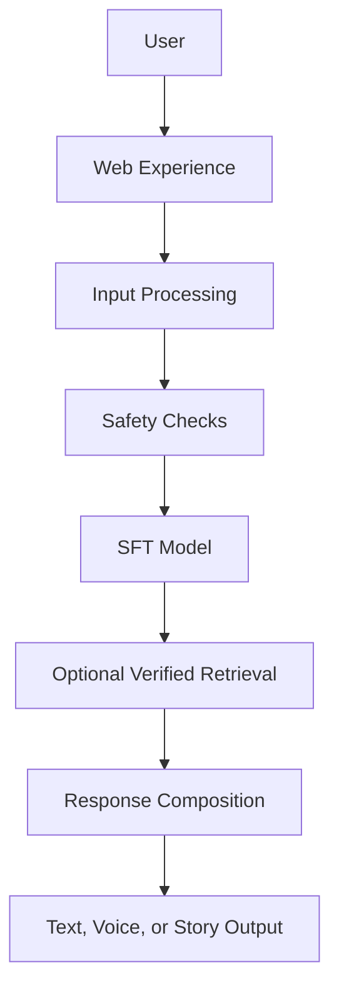

# Architecture

## Public architecture

The web experience receives input; processing and safety checks establish appropriate boundaries; the SFT model generates behaviorally aligned guidance; optional retrieval supports claims that require an exact source; composition prepares the final output; and the experience presents text, voice, or story modes when verified as available.

## Separation of responsibilities

- SFT controls learned behavior and response style.
- Retrieval supports exact factual or scriptural grounding.
- The safety layer handles limitations and high-risk boundaries.
- The website handles the user experience.

## What is intentionally private

Production source code, internal APIs, deployment details, complete database structure, prompt templates, dataset pipeline, adapter weights, private retrieval corpus, and security configuration are intentionally excluded.
